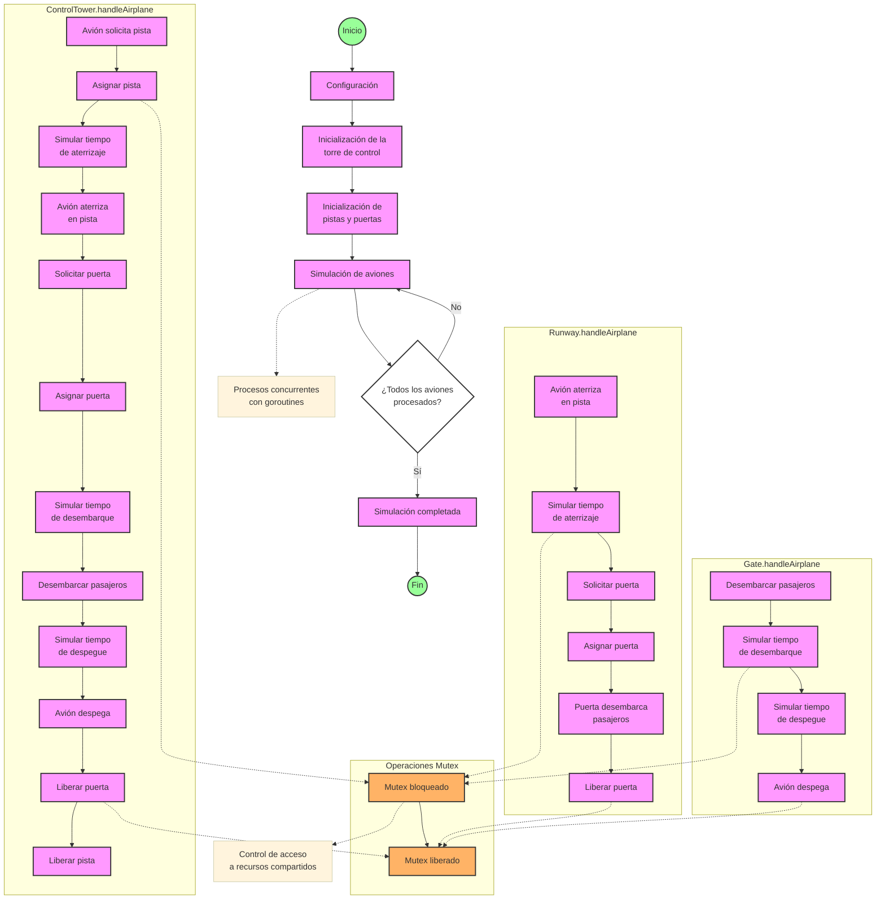

```mermaid
flowchart TD
    %% Flujo Principal
    start((Inicio)) --> config[Configuración]
    config --> initTower[Inicialización de la\ntorre de control]
    initTower --> initRes[Inicialización de\npistas y puertas]
    initRes --> simPlanes[Simulación de aviones]
    simPlanes --> checkDone{¿Todos los aviones\nprocesados?}
    checkDone -- No --> simPlanes
    checkDone -- Sí --> simComplete[Simulación completada]
    simComplete --> finish((Fin))

    subgraph "ControlTower.handleAirplane"
        direction TB
        CT1[Avión solicita pista] --> CT2[Asignar pista]
        CT2 --> CT3[Simular tiempo\nde aterrizaje]
        CT3 --> CT4[Avión aterriza\nen pista]
        CT4 --> CT5[Solicitar puerta]
        CT5 --> CT6[Asignar puerta]
        CT6 --> CT7[Simular tiempo\nde desembarque]
        CT7 --> CT8[Desembarcar pasajeros]
        CT8 --> CT9[Simular tiempo\nde despegue]
        CT9 --> CT10[Avión despega]
        CT10 --> CT11[Liberar puerta]
        CT11 --> CT12[Liberar pista]
    end

    subgraph "Runway.handleAirplane"
        direction TB
        RW1[Avión aterriza\nen pista] --> RW2[Simular tiempo\nde aterrizaje]
        RW2 --> RW3[Solicitar puerta]
        RW3 --> RW4[Asignar puerta]
        RW4 --> RW5[Puerta desembarca\npasajeros]
        RW5 --> RW6[Liberar puerta]
    end

    subgraph "Gate.handleAirplane"
        direction TB
        GT1[Desembarcar pasajeros] --> GT2[Simular tiempo\nde desembarque]
        GT2 --> GT3[Simular tiempo\nde despegue]
        GT3 --> GT4[Avión despega]
    end

    subgraph "Operaciones Mutex"
        direction LR
        MX1[Mutex bloqueado] --> MX2[Mutex liberado]
    end

    %% Conexiones Mutex
    CT2 -.-> MX1
    CT11 -.-> MX2
    RW2 -.-> MX1
    RW6 -.-> MX2
    GT2 -.-> MX1
    GT4 -.-> MX2

    %% Estilos
    classDef process fill:#f9f,stroke:#333,stroke-width:2px;
    classDef decision fill:#fff,stroke:#333,stroke-width:2px;
    classDef start_end fill:#9f9,stroke:#333,stroke-width:2px;
    classDef mutex fill:#ffb366,stroke:#333,stroke-width:2px;
    
    class start,finish start_end;
    class checkDone decision;
    class MX1,MX2 mutex;
    class config,initTower,initRes,simPlanes,simComplete process;
    class CT1,CT2,CT3,CT4,CT5,CT6,CT7,CT8,CT9,CT10,CT11,CT12 process;
    class RW1,RW2,RW3,RW4,RW5,RW6 process;
    class GT1,GT2,GT3,GT4 process;

    %% Notas explicativas
    note1[Procesos concurrentes\ncon goroutines]
    note2[Control de acceso\na recursos compartidos]
    
    simPlanes -.-> note1
    MX1 -.-> note2
    
    style note1 fill:#fff4dd,stroke:#cca,stroke-width:1px
    style note2 fill:#fff4dd,stroke:#cca,stroke-width:1px
```